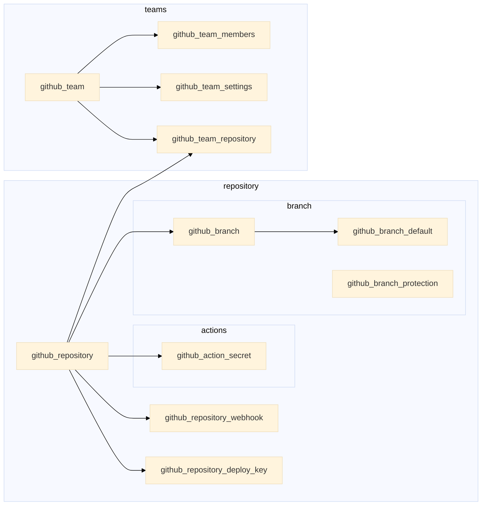
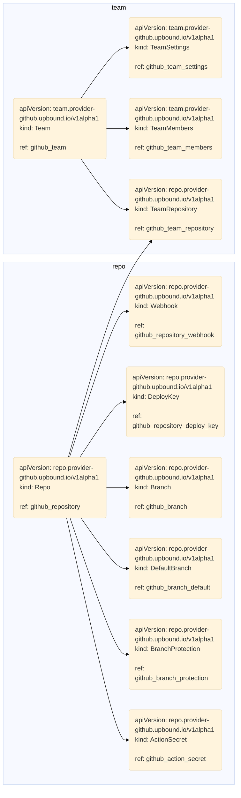

## Layout and naming of resources

### Terraform mapping

```mermaid
%%{init: {'theme':'base'}}%%
graph LR
    github_repository --> github_team_repository
    github_repository --> github_branch
    github_repository --> github_action_secret
    subgraph repository
        github_repository --> github_repository_webhook
        github_repository --> github_repository_deploy_key
        subgraph branch
            github_branch --> github_branch_default
            github_branch_protection
        end
        subgraph actions
            github_action_secret
        end
    end
    subgraph teams
        github_team --> github_team_members
        github_team --> github_team_settings
        github_team --> github_team_repository
    end
```

### Proposed mapping in github provider

```mermaid
%%{
    init: {
        'flowchart' : {
            'curve' : 'basis'
        },
        'theme':'base'
    }
}%%

graph LR
    classDef default text-align: left;
    Repository.repo --> TeamRepository.team
    subgraph repo
        Repository.repo(apiVersion: repo.provider-github.upbound.io/v1alpha1<br/>kind: Repo<br/><br/>ref: github_repository)
        Webhook.repo(apiVersion: repo.provider-github.upbound.io/v1alpha1<br/>kind: Webhook<br/><br/>ref: github_repository_webhook)
        DeployKey.repo(apiVersion: repo.provider-github.upbound.io/v1alpha1<br/>kind: DeployKey<br/><br/>ref: github_repository_deploy_key)
        Branch.repo(apiVersion: repo.provider-github.upbound.io/v1alpha1<br/>kind: Branch<br/><br/>ref: github_branch)
        DefaultBranch.repo(apiVersion: repo.provider-github.upbound.io/v1alpha1<br/>kind: DefaultBranch<br/><br/>ref: github_branch_default)
        BranchProtection.repo(apiVersion: repo.provider-github.upbound.io/v1alpha1<br/>kind: BranchProtection<br/><br/>ref: github_branch_protection)
        ActionSecret.repo(apiVersion: repo.provider-github.upbound.io/v1alpha1<br/>kind: ActionSecret<br/><br/>ref: github_action_secret)
  
        Repository.repo --> Webhook.repo
        Repository.repo --> DeployKey.repo
        Repository.repo --> Branch.repo
        Repository.repo --> DefaultBranch.repo
        Repository.repo --> BranchProtection.repo
        Repository.repo --> ActionSecret.repo
    end
    subgraph team
        Team.team(apiVersion: team.provider-github.upbound.io/v1alpha1<br/>kind: Team<br/><br/>ref: github_team)
        TeamSettings.team(apiVersion: team.provider-github.upbound.io/v1alpha1<br/>kind: TeamSettings<br/><br/>ref: github_team_settings)
        TeamMembers.team(apiVersion: team.provider-github.upbound.io/v1alpha1<br/>kind: TeamMembers<br/><br/>ref: github_team_members)
        TeamRepository.team(apiVersion: repo.provider-github.upbound.io/v1alpha1<br/>kind: TeamRepository<br/><br/>ref: github_team_repository) 

        Team.team --> TeamSettings.team
        Team.team --> TeamMembers.team
        Team.team --> TeamRepository.team
    end
```